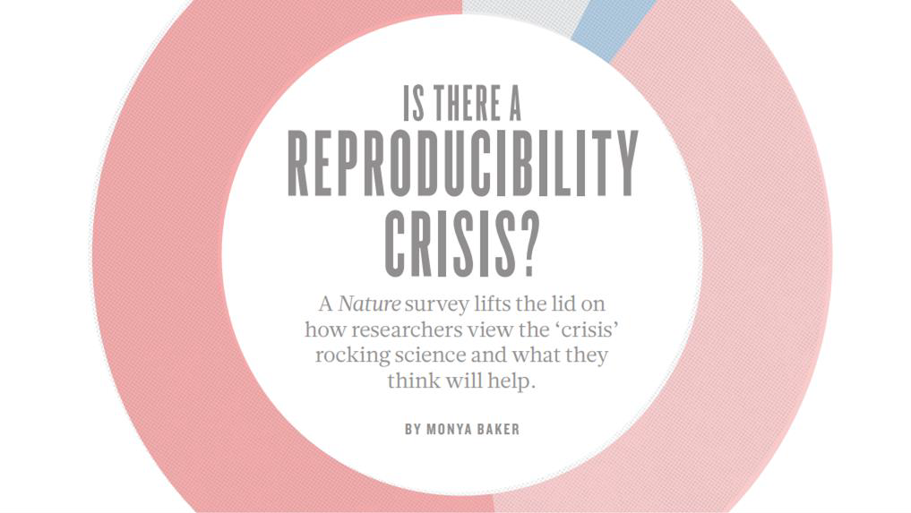
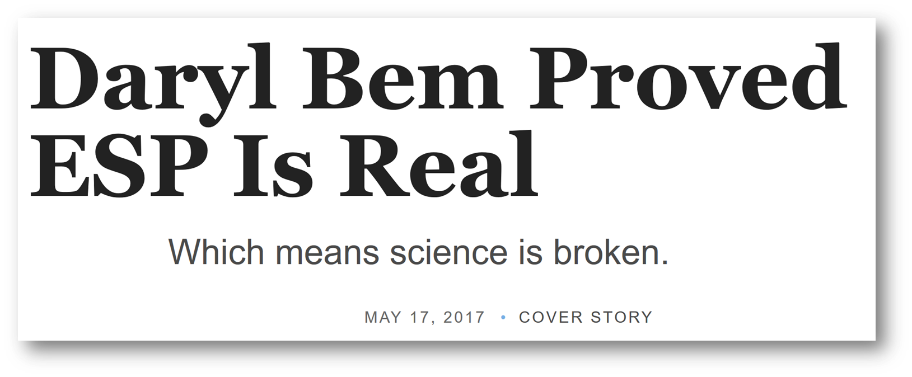
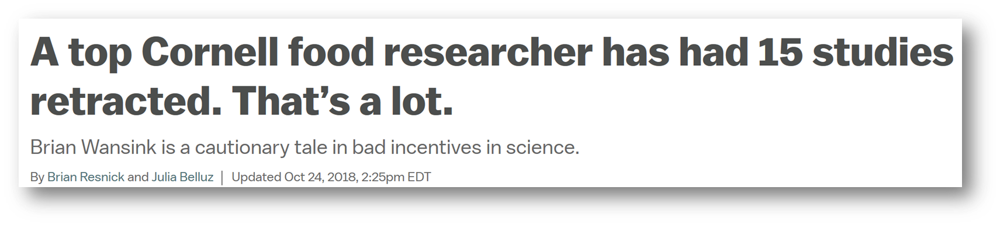
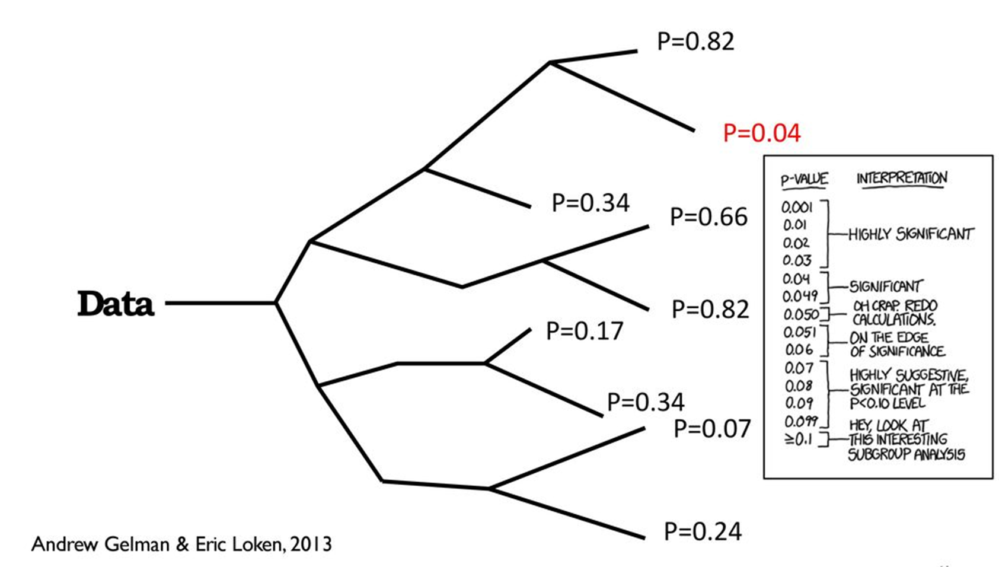
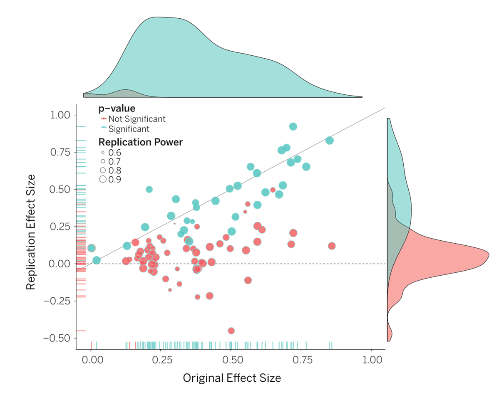

```{r setup}
#| include: false

library(countdown)

knitr::opts_chunk$set(
  fig.width = 8,
  fig.asp = 0.618,
  fig.retina = 3,
  dpi = 300,
  out.width = "80%",
  fig.align = "center"
)

options(scipen = 100)
```

# Now- Science Stuff!

🧑‍🔬 💾 📎 📊

# What makes science...good science?

# The Study Everyone Believed, but Shouldn't Have

[Power Posing](https://faculty.haas.berkeley.edu/dana_carney/power.poses.PS.2010.pdf)

------------------------------------------------------------------------

## Power Posing - Carney, Cuddy & Yapp (2010)

Carney, D. R., Cuddy, A. J., & Yap, A. J. (2010). Power posing: Brief nonverbal displays affect neuroendocrine levels and risk tolerance. *Psychological science*, *21*(10), 1363-1368. [link](https://faculty.haas.berkeley.edu/dana_carney/power.poses.PS.2010.pdf)

::: {.callout-note icon="false"}
"Power posing increases testosterone and risk-taking."
:::

------------------------------------------------------------------------

## Power Posing - Carney, Cuddy & Yapp (2010)

# Replication & Reproducibility

**Replication:** The process of applying the same methodology with a different sample and research group

**Reproduction:** Taking all materials from a study and coming to the same conclusions

## Replication & Reproducibility 🍰

I want to bake a cake!

::: incremental
1.  Find a recipe online (try ignoring their life story narrative)
2.  Get ingredients (Wegmans if you 💰)
3.  Follow recipe and bake 🧑‍🍳
4.  Enjoy the delicious cake 🍽️
:::

. . .

**Replication**

------------------------------------------------------------------------

## Replication & Reproducibility 🍰

I want to bake a cake!

**Reproduction**

::: incremental
1.  Find a recipe online –\> **Find their kitchen**
2.  Get ingredients –\> **Use their ingredients**
3.  Follow recipe and bake –\> **Watch what they do and follow**
4.  Enjoy the delicious cake –\> **Enjoy cake (and jail for B&E)**
:::

------------------------------------------------------------------------

## Replication & Reproducibility 📊

<br></br>

| Replication | Reproducibility |
|----|----|
| Have a similar research question | Use the same research question |
| Collect your own data | Use their data |
| Follow their steps with **your** resources | Follow their steps with **their** resources |
| Outcome: Similar results (depends on other factors) | Outcome: Identical results |

------------------------------------------------------------------------

## Replication & Reproducibility 📊

[Goals of Science]{.underline}

**Important:** We want to ***replicate*** other researchers work

**MOST Important:** Be able to ***reproduce*** all of our results

You are your own worst collaborator!

# Does this play out in the field??

# 

------------------------------------------------------------------------

{.absolute top="100"}

::: fragment
{.absolute bottom="0" right="0"}
:::

::: fragment
{.absolute top="0" left="0"}
:::

::: fragment
{.absolute top="200" right="0" width="300"} {.absolute top="275" left="0" width="300"}
:::

------------------------------------------------------------------------

## Garden of Forking Paths

::: fragment

:::

------------------------------------------------------------------------

::::: columns
::: {.column width="35%"}
100 Replication Studies Adequately Powered

**Original Studies:**

- Mean Effect: 0.403

- \% with p\<.05: 97%

**Replication Studies:**

- Mean Effect: 0.197

- \% with p\<.05: 47%
:::

::: {.column width="65%"}

:::
:::::

------------------------------------------------------------------------

# What can we do about it? 🤷

------------------------------------------------------------------------

::: {layout="[[-1], [1], [-1]]"}
{fig-align="center"}
:::

------------------------------------------------------------------------

## Installing and Using R

[From the course website](../resources.html)

[Modern Statistics Using R](https://www.modernstatisticswithr.com/thebasics.html){target="_blank"}

## Working with R-Studio

R-Studio is just like a kitchen 🧑‍🍳

The Environment pane is the pantry/fridge

The Console is like the oven/stove

The Markdown document is the recipe

The bottom right sometimes acts as the little window on the oven where you can see things baking

Creating a Project puts these things in their place

------------------------------------------------------------------------

## Next Steps

- Create a project

- Set up a Markdown Document

- Run and Knit the document

- Live Example

# In Class Workshop

Create a new .Rmd file and name it `introduction.Rmd`

In the markdown, delete everything that is unnecessary

Introduce yourself in the text portion of the document

Load `tidyverse` and use the `starwars` dataset

For full instructions, navigate to [Day 1 In Class Activity](../class-activities/day1.html){target="_blank"}
